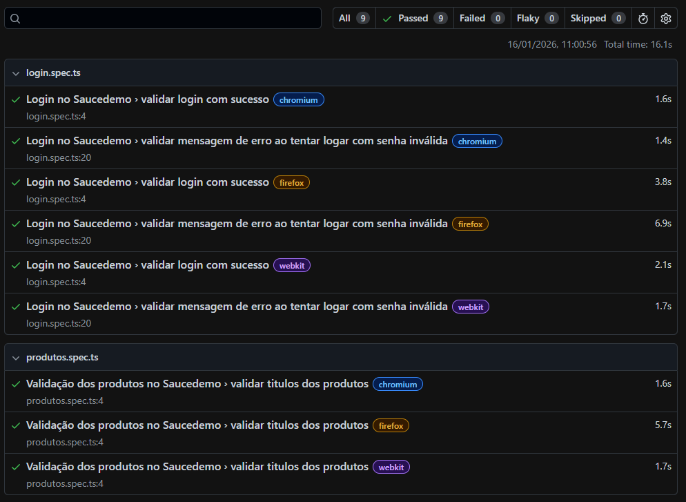

## Testes com Playwright no Saucedemo

Testes de validação de login e página de produtos do [Saucedemo](https://www.saucedemo.com/) executados durante o  [Curso básico de Playwright](https://www.youtube.com/playlist?list=PLu6sLyecW1TjbX7mSfnoORw9G3RJPCrVs) do Canal — Marcos Franco (Start QA).

## Instalação e comandos
- Clonar o projeto:
``` bash
git clone https://github.com/vpaesi/playwright_saucedemo.git
cd playwright_saucedemo
npm install
```

- Executar todos os testes:
```bash
npm run test
```

- Executar um arquivo específico:
```bash
npm run test <nome-do-arquivo>
# ex: npm run test produtos
```

- Executar testes no Modo UI:
```bash
npx playwright test --ui
```

## Relatório e verificação
- Ao rodar os testes, é gerado um `index.html` em `playwright-report` que pode ser aberto no navegador para visualizar resultados.



## Anotações
- Minhas anotações pessoais realizadas durante o curso foram inseridas no arquivo `notes.md`
