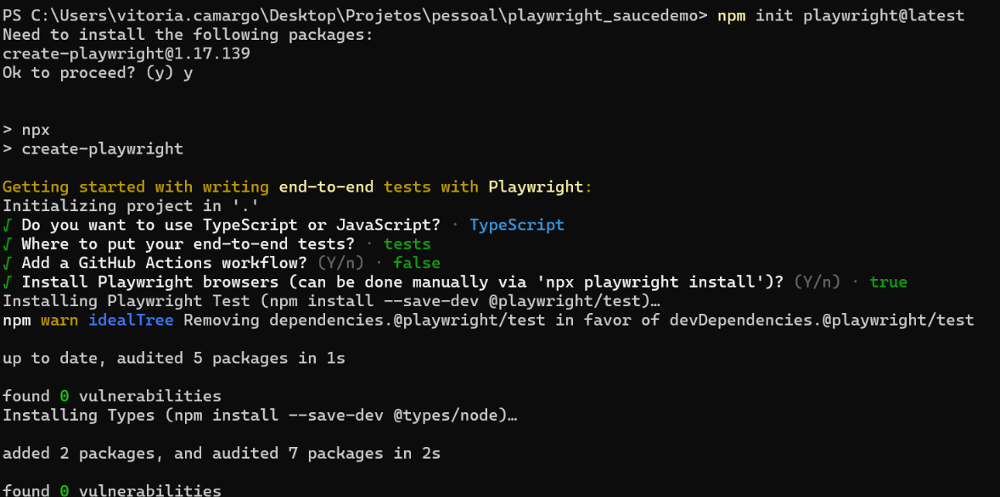
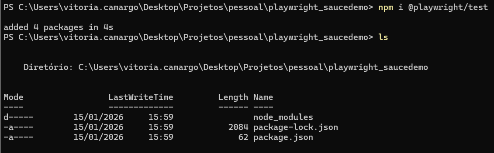
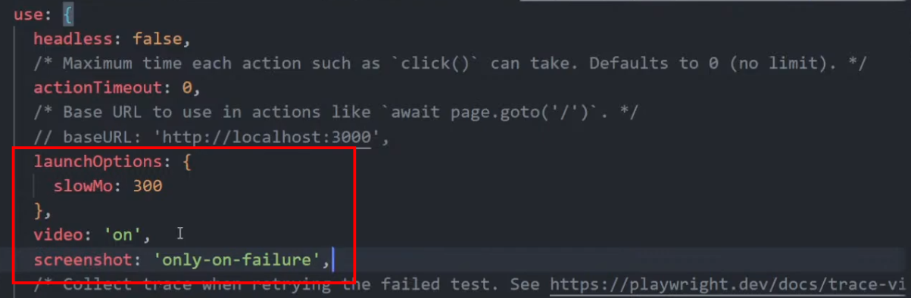
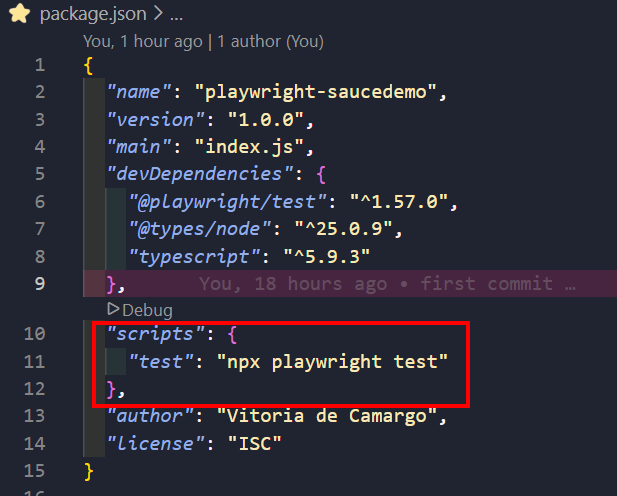

# Anotações do curso
* [Curso básico de Playwright — Marcos Franco (Start QA)](https://www.youtube.com/playlist?list=PLu6sLyecW1TjbX7mSfnoORw9G3RJPCrVs)

## Instalação do Playwright em um projeto
1. Na pasta do projeto, instale o Playwright:
```bash
npm i @playwright/test
```
2. Inicie a configuração pelo assistente:
```bash
npm init playwright@latest
```
3. Escolha TypeScript (TS), pasta de testes, desative GitHub Actions se desejar e selecione os browsers.


4. Após instalar, execute `ls` e confirme que existem `node_modules` e `package.json` na pasta do projeto.


## Configuração adicional
Em `playwright.config.ts` você pode:
   - diminuir a velocidade dos testes (slowMo/launchOptions) para depuração,
   - ativar gravação de vídeo (`video`) e captura de tela (`screenshot`).
    

## Executando os testes
- Primeiramente, configure no `package.json` o script `test` como `npx playwright test`:


- Executar todos os testes:
```bash
npm run test
```

- Executar um arquivo específico:
```bash
npm run test <nome-do-arquivo>
# ex: npm run test produtos
```

- Executar testes no Modo UI:
```bash
npx playwright test --ui
```

## Relatório e verificação
- Ao rodar os testes, é gerado um `index.html` em `playwright-report` que pode ser aberto no navegador para visualizar resultados.


## Arquivos criados
Durante o curso, foram criados os testes na seguinte ordem:
1. `login.spec.ts`
2. `produtos.spec.ts`